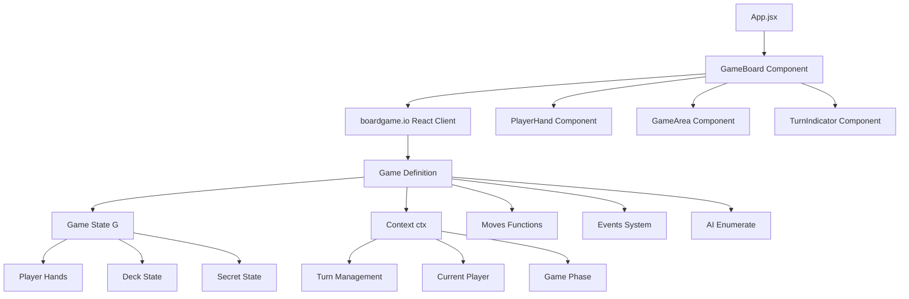

# Phase 1: Core Game Foundation Design Document

## Overview

Phase 1 establishes the fundamental foundation for the Exploding Kittens web game using boardgame.io and React. This design creates the essential gameplay loop where players take turns playing cards or drawing from the deck, with the core tension of avoiding Exploding Kitten cards. The system supports exactly 4 players (1 human player and 3 basic CPU players) and establishes core game state management for future feature expansion.

The design leverages the existing technology stack of React 19, boardgame.io 0.50.2, Vite 7, and Tailwind CSS 3.4. The architecture follows React component patterns with centralized state management through boardgame.io's framework. The system implements only essential cards (regular cards, Exploding Kittens, and Defuse cards) to create a minimal viable game that demonstrates basic mechanics without complex interactions.

This foundation prioritizes code simplicity and extensibility, establishing patterns that accommodate future phases including advanced action cards, player interactions, and sophisticated AI opponents. The design ensures proper separation of concerns between game logic (boardgame.io), UI components (React), and styling (Tailwind CSS).

The system architecture supports real-time game state updates, automated CPU player behavior, and clear visual feedback for all game actions. Error handling and edge cases are addressed to create a robust foundation for iterative development.

## Architecture

### System Components



### Data Flow

1. **User Interaction**: Player clicks card or draw button, triggering React event handlers
2. **Move Dispatch**: React components call `moves.playCard()` or `moves.drawCard()` through props
3. **Game Logic**: boardgame.io processes moves, validates via `INVALID_MOVE`, mutates `G`
4. **Framework Processing**: boardgame.io handles immutability, updates `ctx`, manages turn flow
5. **AI Processing**: After human moves, `ai.enumerate` generates CPU moves automatically
6. **State Propagation**: Updated `{G, ctx}` propagates to React components via props
7. **UI Re-render**: Components re-render with new state, displaying updated game status
8. **Secret State**: Framework strips secret information per player via `playerView`

## Components and Interfaces

### GameBoard Component

Primary React component that receives game state and move functions through boardgame.io's React Client props system.

#### Key Features

**Props Integration**: Receives `G`, `ctx`, `moves`, `events`, `playerID`, and `isActive` from boardgame.io client, providing complete game state access.

**Turn Management**: Uses `ctx.currentPlayer`, `ctx.turn`, and `isActive` prop to display current player, available actions, and turn progression with conditional UI rendering.

**Move Dispatch**: Calls `moves.playCard(cardIndex)` and `moves.drawCard()` directly through props, with automatic validation and state updates handled by framework.

**Game State Display**: Shows deck counts via `G.deck.length`, discard pile via `G.discardPile`, player information via `G.players`, and elimination status with real-time updates from `G` and `ctx`.

**Game Over Handling**: Displays winner information using `ctx.gameover.winner` when game ends.

#### Design Rationale

The GameBoard leverages boardgame.io's React integration patterns where the framework manages all state and provides it via props. This eliminates manual state management while ensuring automatic updates, move validation, and proper turn handling through the boardgame.io system.

### Game Logic Engine

Core boardgame.io game definition that manages all game rules, state transitions, and move validation using the framework's established patterns.

#### Component Structure

```javascript
import { INVALID_MOVE, TurnOrder, PlayerView } from 'boardgame.io/core';

/**
 * Game state object structure (G)
 * @typedef {Object} GameState
 * @property {Array} deck - Array of card objects in the draw pile
 * @property {Object} players - Object mapping player IDs to player objects
 * @property {Array} discardPile - Array of discarded card objects
 * @property {Object} secret - Hidden state for deck order and face-down information
 */

/**
 * Framework context object (ctx) - managed by boardgame.io
 * @typedef {Object} Context
 * @property {number} turn - Current turn number
 * @property {string} currentPlayer - ID of current player
 * @property {number} numPlayers - Total number of players
 * @property {string} phase - Current game phase
 * @property {Object|null} gameover - Game end state with winner info
 * @property {Array} playOrder - Order of player turns
 */

/**
 * Player object structure
 * @typedef {Object} Player
 * @property {string} id - Unique player identifier
 * @property {string} name - Display name for player
 * @property {Array} hand - Array of card objects in player's hand
 * @property {boolean} isEliminated - Whether player has been eliminated
 * @property {boolean} isCPU - Whether this is a CPU-controlled player
 */

/**
 * Card object structure
 * @typedef {Object} Card
 * @property {string} id - Unique card identifier
 * @property {string} type - Card type: 'exploding', 'defuse', or 'regular'
 * @property {string} name - Display name for card
 * @property {string} emoji - Emoji representation of card
 */

const ExplodingKittensGame = {
  name: 'exploding-kittens-phase1',
  
  setup: ({ ctx, random }) => {
    // Initialize game state using ctx.numPlayers and random for shuffling
    const players = {};
    for (let i = 0; i < ctx.numPlayers; i++) {
      players[i] = {
        id: i.toString(),
        name: i === 0 ? 'You' : `CPU ${i}`,
        hand: [],
        isEliminated: false,
        isCPU: i !== 0
      };
    }
    
    const deck = createInitialDeck(ctx.numPlayers, random);
    
    return {
      deck,
      players,
      discardPile: [],
      secret: {
        deckOrder: deck.map(c => c.id)
      }
    };
  },
  
  moves: {
    playCard: ({ G, ctx, playerID, events }, cardIndex) => {
      // Validate move using INVALID_MOVE
      if (!canPlayCard(G, playerID, cardIndex)) {
        return INVALID_MOVE;
      }
      
      // Mutate G directly - framework handles immutability
      const card = G.players[playerID].hand.splice(cardIndex, 1)[0];
      G.discardPile.push(card);
      
      // Simple cards automatically end turn
      events.endTurn();
    },
    
    drawCard: ({ G, ctx, playerID, events }) => {
      if (G.deck.length === 0) return INVALID_MOVE;
      
      const card = G.deck.pop();
      G.players[playerID].hand.push(card);
      
      if (card.type === 'exploding') {
        handleExplodingKitten(G, ctx, playerID, events);
      } else {
        events.endTurn();
      }
    },
    
    placeExplodingKitten: ({ G, ctx, playerID, events, random }, position) => {
      // Move validation and deck insertion logic
      if (!hasDefuseCard(G.players[playerID])) {
        return INVALID_MOVE;
      }
      
      // Insert exploding kitten back into deck
      insertCardInDeck(G, createExplodingKitten(), position, random);
      events.endTurn();
    }
  },
  
  turn: {
    order: TurnOrder.DEFAULT,
    minMoves: 1,
    maxMoves: 1,
    
    onBegin: ({ G, ctx, events }) => {
      // Skip eliminated players
      if (G.players[ctx.currentPlayer].isEliminated) {
        events.endTurn();
      }
    }
  },
  
  phases: {
    setup: {
      start: true,
      moves: { /* Deal initial hands */ },
      endIf: ({ G }) => allPlayersHaveInitialHands(G),
      next: 'playing'
    },
    
    playing: {
      moves: { playCard, drawCard, placeExplodingKitten },
      endIf: ({ G }) => getAlivePlayers(G).length <= 1
    }
  },
  
  endIf: ({ G, ctx }) => {
    const alivePlayers = getAlivePlayers(G);
    if (alivePlayers.length === 1) {
      return { winner: alivePlayers[0].id };
    }
    if (alivePlayers.length === 0) {
      return { draw: true };
    }
  },
  
  ai: {
    enumerate: ({ G, ctx }) => {
      const moves = [];
      const player = G.players[ctx.currentPlayer];
      
      // Only enumerate for CPU players
      if (!player.isCPU) return moves;
      
      // Add valid card plays
      player.hand.forEach((card, index) => {
        if (canPlayCard(G, ctx.currentPlayer, index)) {
          moves.push({ move: 'playCard', args: [index] });
        }
      });
      
      // Add draw card option
      if (canDrawCard(G, ctx.currentPlayer)) {
        moves.push({ move: 'drawCard', args: [] });
      }
      
      return moves;
    }
  },
  
  // Hide secret information from players
  playerView: PlayerView.STRIP_SECRETS,
  
  // Deterministic randomness for testing
  seed: 'phase1-development'
};
```

## Data Models

### Game State Model (G)

```javascript
// boardgame.io manages this as G object
const gameState = {
  // Core game data
  deck: [], // Array of card objects
  players: {}, // Object with player IDs as keys
  discardPile: [], // Array of discarded cards
  
  // Secret state (hidden via playerView)
  secret: {
    deckOrder: [], // Original deck order for deterministic play
    explodingKittenPositions: [] // Positions of exploding kittens
  }
};
```

### Framework Context Model (ctx)

```javascript
// boardgame.io manages this as ctx object - READ ONLY
const context = {
  // Turn management - managed by framework
  turn: 0, // Current turn number
  currentPlayer: '0', // ID of current player
  playOrder: ['0', '1', '2', '3'], // Order of players
  playOrderPos: 0, // Position in play order
  
  // Game flow - managed by framework
  phase: 'playing', // Current phase name
  numPlayers: 4, // Total players
  
  // Game outcome - set by endIf
  gameover: null, // { winner: 'playerId' } or { draw: true }
  
  // Activity tracking
  activePlayers: null // For simultaneous play (future phases)
};
```

### Player Data Model

```javascript
// Example player object
const player = {
  id: 'player-1', // Unique identifier
  name: 'You', // Display name
  hand: [], // Array of card objects
  isEliminated: false, // Elimination status
  isCPU: false, // Whether CPU controlled
  defuseCount: 1, // Number of defuse cards
  handSize: 8 // Total cards in hand
};

// Example CPU player
const cpuPlayer = {
  id: 'cpu-1',
  name: 'CPU 1',
  hand: [],
  isEliminated: false,
  isCPU: true,
  defuseCount: 1,
  handSize: 8
};
```

### Card System Model

```javascript
// Example card objects
const explodingKittenCard = {
  id: 'card-1',
  type: 'exploding',
  name: 'Exploding Kitten',
  emoji: '💥🐱',
  description: 'Explode unless you have a Defuse card'
};

const defuseCard = {
  id: 'card-2',
  type: 'defuse',
  name: 'Defuse',
  emoji: '🛡️',
  description: 'Defuse an Exploding Kitten'
};

const regularCard = {
  id: 'card-3',
  type: 'regular',
  name: 'Regular Card',
  emoji: '🐾',
  description: 'Safe to play or keep'
};

// Card type definitions for easy reference
const CARD_TYPES = {
  EXPLODING: 'exploding',
  DEFUSE: 'defuse',
  REGULAR: 'regular'
};

// Card creation helper
function createCard(type, name, emoji, description = '') {
  return {
    id: `card-${Date.now()}-${Math.random()}`,
    type,
    name,
    emoji,
    description
  };
}
```

### Move Function Examples

```javascript
// boardgame.io move functions - proper patterns

// Playing a card with validation
const playCard = ({ G, ctx, playerID, events }, cardIndex) => {
  // Validation - return INVALID_MOVE for invalid actions
  const player = G.players[playerID];
  if (!player || player.isEliminated || cardIndex >= player.hand.length) {
    return INVALID_MOVE;
  }
  
  // Mutate G directly - framework handles immutability
  const card = player.hand.splice(cardIndex, 1)[0];
  G.discardPile.push(card);
  
  // Use events for turn management
  events.endTurn();
};

// Drawing a card with game logic
const drawCard = ({ G, ctx, playerID, events, random }) => {
  if (G.deck.length === 0) return INVALID_MOVE;
  
  const drawnCard = G.deck.pop();
  G.players[playerID].hand.push(drawnCard);
  
  // Handle special card types
  if (drawnCard.type === 'exploding') {
    if (hasDefuseCard(G.players[playerID])) {
      // Player can defuse - transition to defuse stage
      events.setStage('defusing');
    } else {
      // Player is eliminated
      G.players[playerID].isEliminated = true;
      events.endTurn();
    }
  } else {
    events.endTurn();
  }
};

// Example helper functions
function hasDefuseCard(player) {
  return player.hand.some(card => card.type === 'defuse');
}

function canPlayCard(G, playerID, cardIndex) {
  const player = G.players[playerID];
  return player && !player.isEliminated && cardIndex < player.hand.length;
}

// AI move enumeration
const enumerateMoves = ({ G, ctx }) => {
  const moves = [];
  const player = G.players[ctx.currentPlayer];
  
  // Don't enumerate for human player
  if (!player.isCPU) return moves;
  
  // Add playable cards
  player.hand.forEach((card, index) => {
    if (canPlayCard(G, ctx.currentPlayer, index)) {
      moves.push({ move: 'playCard', args: [index] });
    }
  });
  
  // Add draw option
  if (G.deck.length > 0) {
    moves.push({ move: 'drawCard', args: [] });
  }
  
  return moves;
};
```

## Error Handling

### Basic Error Management
- Handle invalid moves by preventing them in the UI (disable buttons for invalid actions)
- Show simple error messages for edge cases like empty deck or invalid card plays
- Use basic try-catch blocks around critical game logic to prevent crashes

## Implementation Phases

### Phase 1.1: Core Game Infrastructure
- Implement boardgame.io game definition with `setup`, `moves`, and `endIf`
- Create deck generation using `random.Shuffle()` for deterministic randomness
- Establish player data structures using proper `G` and `ctx` patterns
- Configure `playerView` for secret state management
- Success criteria: Game initializes with 4 players, proper deck, and framework integration

### Phase 1.2: Turn-Based Gameplay
- Implement `playCard` and `drawCard` moves with `INVALID_MOVE` validation
- Add Exploding Kitten detection and Defuse card mechanics using game logic
- Configure `turn.order`, `turn.minMoves`, `turn.maxMoves` for automatic turn management
- Use `events.endTurn()` and `events.endGame()` for flow control
- Success criteria: Complete turn cycle with move validation and automatic progression

### Phase 1.3: User Interface Implementation
- Build React components receiving `G`, `ctx`, `moves`, `events` via props
- Implement move dispatch using `moves.playCard()` and `moves.drawCard()`
- Use `ctx.currentPlayer`, `isActive`, and `playerID` for turn indicators
- Display game state using `G.players`, `G.deck.length`, `ctx.gameover`
- Success criteria: Fully interactive UI integrated with boardgame.io client

### Phase 1.4: CPU Player Integration
- Implement `ai.enumerate` function returning valid move arrays
- Configure framework's built-in MCTS bot for CPU decision-making
- Use `player.isCPU` flags and framework's automatic AI turn handling
- Test AI move generation and execution through boardgame.io system
- Success criteria: Complete 4-player game with 3 CPU opponents using framework AI

## Success Metrics

### Basic Functionality
- Game initializes properly with 4 players
- Turn cycle works correctly for all players
- Exploding Kitten and Defuse mechanics function as expected
- Game ends with proper winner declaration