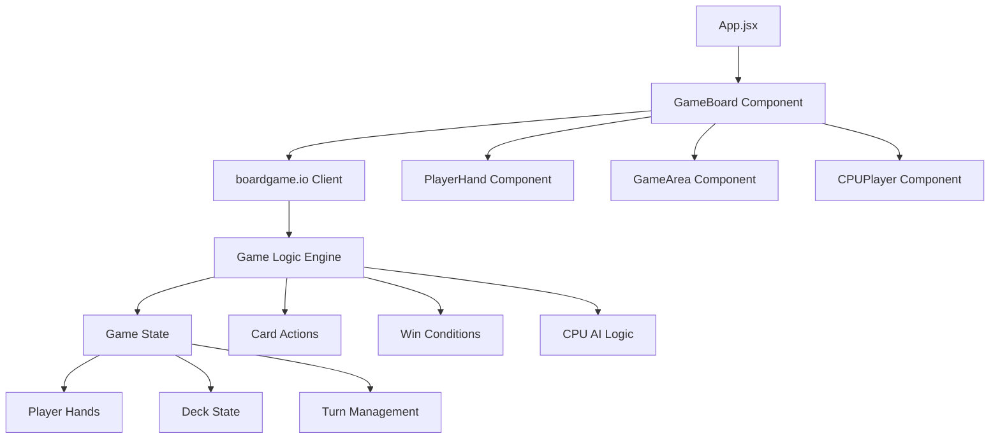

# Phase 1: Core Game Foundation Design Document

## Overview

Phase 1 establishes the fundamental foundation for the Exploding Kittens web game using boardgame.io and React. This design creates the essential gameplay loop where players take turns playing cards or drawing from the deck, with the core tension of avoiding Exploding Kitten cards. The system supports exactly 4 players (1 human player and 3 basic CPU players) and establishes core game state management for future feature expansion.

The design leverages the existing technology stack of React 19, boardgame.io 0.50.2, Vite 7, and Tailwind CSS 3.4. The architecture follows React component patterns with centralized state management through boardgame.io's framework. The system implements only essential cards (regular cards, Exploding Kittens, and Defuse cards) to create a minimal viable game that demonstrates basic mechanics without complex interactions.

This foundation prioritizes code simplicity and extensibility, establishing patterns that accommodate future phases including advanced action cards, player interactions, and sophisticated AI opponents. The design ensures proper separation of concerns between game logic (boardgame.io), UI components (React), and styling (Tailwind CSS).

The system architecture supports real-time game state updates, automated CPU player behavior, and clear visual feedback for all game actions. Error handling and edge cases are addressed to create a robust foundation for iterative development.

## Architecture

### System Components



### Data Flow

1. **User Interaction**: Player clicks card or draw button, triggering React event handlers
2. **Move Dispatch**: React components call boardgame.io moves through the client API
3. **Game Logic**: boardgame.io processes moves, validates actions, and updates game state
4. **State Propagation**: Updated game state propagates back to React components via props
5. **UI Re-render**: Components re-render with new state, displaying updated game status

## Components and Interfaces

### GameBoard Component

Primary React component that orchestrates the entire game interface and manages player interactions with the boardgame.io client.

#### Key Features

**Turn Management**: Displays current player, available actions, and turn progression with clear visual indicators using Tailwind CSS styling for active states.

**Card Interaction**: Handles human player card selection, play actions, and draw decisions with responsive UI feedback and validation.

**Game State Display**: Shows deck counts, discard pile, player information, and elimination status with real-time updates and clear visual hierarchy.

#### Design Rationale

The GameBoard serves as the single source of truth for UI state while delegating game logic to boardgame.io. This separation ensures clean architecture and testability while maintaining React's declarative UI patterns.

### Game Logic Engine

Core boardgame.io game definition that manages all game rules, state transitions, and move validation.

#### Component Structure

```javascript
/**
 * Game state object structure
 * @typedef {Object} GameState
 * @property {Array} deck - Array of card objects in the draw pile
 * @property {Object} players - Object mapping player IDs to player objects
 * @property {Array} discardPile - Array of discarded card objects
 * @property {number} currentPlayer - Index of current player
 * @property {string} gamePhase - Current phase: 'setup', 'playing', or 'ended'
 * @property {string|null} winner - ID of winning player or null
 * @property {Array} explodingKittenPositions - Positions of exploding kittens in deck
 */

/**
 * Player object structure
 * @typedef {Object} Player
 * @property {string} id - Unique player identifier
 * @property {string} name - Display name for player
 * @property {Array} hand - Array of card objects in player's hand
 * @property {boolean} isEliminated - Whether player has been eliminated
 * @property {boolean} isCPU - Whether this is a CPU-controlled player
 */

/**
 * Card object structure
 * @typedef {Object} Card
 * @property {string} id - Unique card identifier
 * @property {string} type - Card type: 'exploding', 'defuse', or 'regular'
 * @property {string} name - Display name for card
 * @property {string} emoji - Emoji representation of card
 */

const ExplodingKittensGame = {
  name: 'exploding-kittens-phase1',
  setup: (ctx) => {
    // Returns GameState object
  },
  moves: {
    playCard: (G, ctx, cardIndex) => {
      // Plays card at cardIndex from current player's hand
    },
    drawCard: (G, ctx) => {
      // Current player draws a card from deck
    },
    placeExplodingKitten: (G, ctx, position) => {
      // Places exploding kitten back in deck at position
    }
  },
  endIf: (G, ctx) => {
    // Returns { winner: playerId } or undefined
  },
  ai: {
    enumerate: (G, ctx) => {
      // Returns array of possible moves for CPU players
    }
  }
};
```

## Data Models

### Game State Model

```javascript
// Example game state object
const gameState = {
  // Core game data
  deck: [], // Array of card objects
  players: {}, // Object with player IDs as keys
  discardPile: [], // Array of discarded cards
  
  // Turn management
  currentPlayer: 0, // Index of current player
  gamePhase: 'setup', // 'setup', 'playing', or 'ended'
  
  // Game outcome
  winner: null, // Player ID or null
  eliminatedPlayers: [], // Array of eliminated player IDs
  
  // Deck tracking
  explodingKittenPositions: [], // Positions of exploding kittens
  deckCount: 0 // Number of cards in deck
};
```

### Player Data Model

```javascript
// Example player object
const player = {
  id: 'player-1', // Unique identifier
  name: 'You', // Display name
  hand: [], // Array of card objects
  isEliminated: false, // Elimination status
  isCPU: false, // Whether CPU controlled
  defuseCount: 1, // Number of defuse cards
  handSize: 8 // Total cards in hand
};

// Example CPU player
const cpuPlayer = {
  id: 'cpu-1',
  name: 'CPU 1',
  hand: [],
  isEliminated: false,
  isCPU: true,
  defuseCount: 1,
  handSize: 8
};
```

### Card System Model

```javascript
// Example card objects
const explodingKittenCard = {
  id: 'card-1',
  type: 'exploding',
  name: 'Exploding Kitten',
  emoji: '💥🐱',
  description: 'Explode unless you have a Defuse card'
};

const defuseCard = {
  id: 'card-2',
  type: 'defuse',
  name: 'Defuse',
  emoji: '🛡️',
  description: 'Defuse an Exploding Kitten'
};

const regularCard = {
  id: 'card-3',
  type: 'regular',
  name: 'Regular Card',
  emoji: '🐾',
  description: 'Safe to play or keep'
};

// Card type definitions for easy reference
const CARD_TYPES = {
  EXPLODING: 'exploding',
  DEFUSE: 'defuse',
  REGULAR: 'regular'
};

// Card creation helper
function createCard(type, name, emoji, description = '') {
  return {
    id: `card-${Date.now()}-${Math.random()}`,
    type,
    name,
    emoji,
    description
  };
}
```

### Move Function Examples

```javascript
// Example move function calls

// Playing a card (cardIndex is position in player's hand)
playCard(gameState, ctx, 2); // Play card at index 2

// Drawing a card
drawCard(gameState, ctx); // Current player draws

// Placing exploding kitten back in deck
placeExplodingKitten(gameState, ctx, 5); // Place at position 5

// Move validation helper
function isValidMove(gameState, playerId, moveType, ...args) {
  // Returns true if move is valid for current game state
}

// Example move data structure for boardgame.io
const exampleMoves = {
  playCard: {
    cardIndex: 2,
    timestamp: Date.now()
  },
  drawCard: {
    timestamp: Date.now()
  },
  placeExplodingKitten: {
    position: 5,
    timestamp: Date.now()
  }
};
```

## Error Handling

### Basic Error Management
- Handle invalid moves by preventing them in the UI (disable buttons for invalid actions)
- Show simple error messages for edge cases like empty deck or invalid card plays
- Use basic try-catch blocks around critical game logic to prevent crashes

## Implementation Phases

### Phase 1.1: Core Game Infrastructure
- Implement boardgame.io game definition with setup and basic moves
- Create deck generation and shuffling algorithms
- Establish player data structures and turn management
- Success criteria: Game initializes with 4 players and proper deck composition

### Phase 1.2: Turn-Based Gameplay
- Implement playCard and drawCard moves with validation
- Add Exploding Kitten detection and Defuse card mechanics
- Create player elimination and win condition logic
- Success criteria: Complete turn cycle works with human player input

### Phase 1.3: User Interface Implementation
- Build React components for game board and player hands
- Implement Tailwind CSS styling for cards and game elements
- Add turn indicators and game state visualization
- Success criteria: Fully interactive UI for human player

### Phase 1.4: CPU Player Integration
- Implement basic AI logic for CPU decision-making
- Add automated turn progression and timing delays
- Integrate CPU actions with UI feedback and animations
- Success criteria: Complete 4-player game with 3 CPU opponents

## Success Metrics

### Basic Functionality
- Game initializes properly with 4 players
- Turn cycle works correctly for all players
- Exploding Kitten and Defuse mechanics function as expected
- Game ends with proper winner declaration